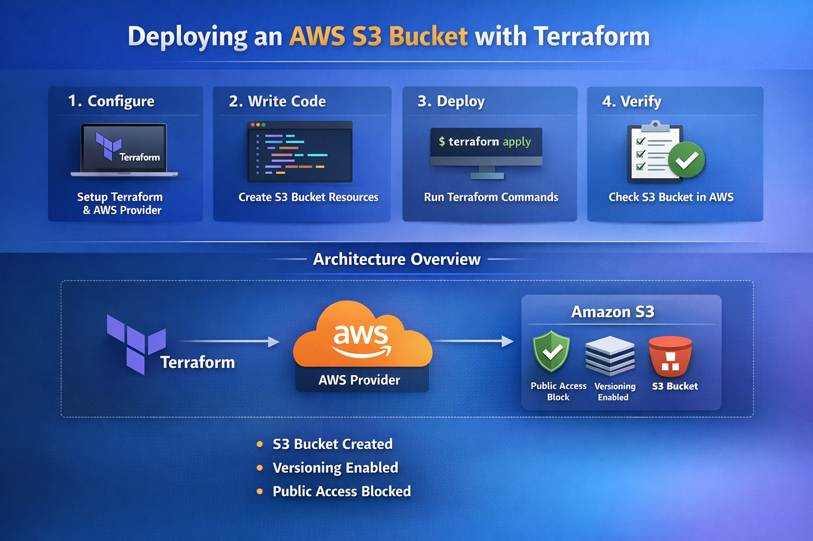
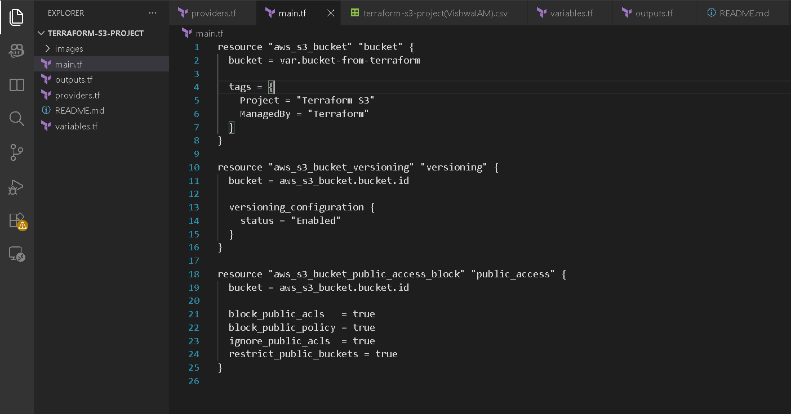
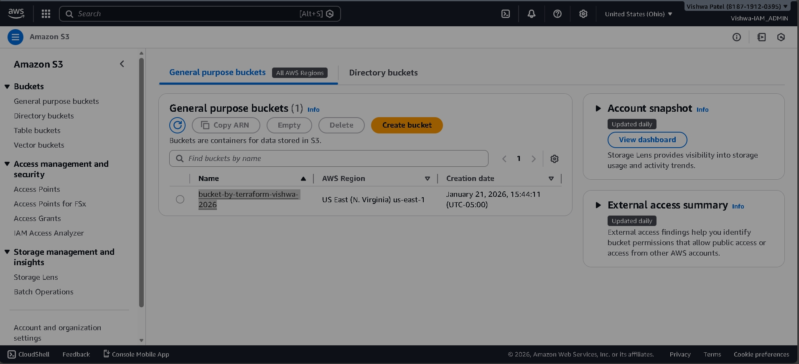
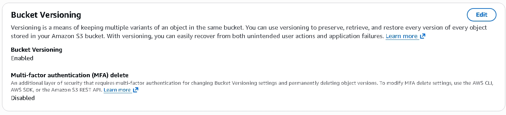

# 🚀 Terraform AWS S3 Bucket Project

This project demonstrates how to create and manage an AWS S3 bucket using Terraform, including enabling versioning, validating state files, and securely structuring your Terraform configuration.

It is designed as a **portfolio-ready cloud engineering project** to help you strengthen your skills and resume.

---

## 📘 Project Architecture

The diagram below shows how Terraform interacts with AWS during this project:



---

## 🧰 Prerequisites

Before starting, make sure you have the following installed:

### Local Requirements
- Terraform (v1.0+ recommended)
  Download & install: https://developer.hashicorp.com/terraform/downloads
  Verify installation:
  terraform -v

- AWS CLI
Install AWS CLI: https://docs.aws.amazon.com/cli/latest/userguide/getting-started-install.html
Verify:
aws --version

-AWS Credentials
You must configure IAM credentials locally:
aws configure
Provide:
AWS Access Key ID
AWS Secret Access Key
Default region (e.g., us-east-1)
Output format (optional)

- Git
https://git-scm.com/downloads


- VS Code (or any code editor)
https://code.visualstudio.com/download

### AWS Requirements
- An AWS account
- An IAM user with the following permissions:
  - `AmazonS3FullAccess`
  - `IAMReadOnlyAccess`
  - `AmazonEC2ReadOnlyAccess`

### Authentication
Run this before using Terraform:

```bash
aws configure
Provide your AWS Access Key and Secret Key.

📂 Project Structure
terraform-s3-project/
│── main.tf
│── variables.tf       (optional)
│── outputs.tf         (optional)
│── assets/            (contains screenshots)
🛠️ Terraform Configuration (main.tf)
This is the file where your S3 bucket is defined.



📦 Deploying the Infrastructure
1️⃣ Initialize Terraform

terraform init
2️⃣ Validate the configuration

terraform validate
3️⃣ Plan the infrastructure

terraform plan
4️⃣ Apply changes to AWS

terraform apply


🗄️ Verifying Your S3 Bucket in AWS Console
After applying, go to:

AWS Console → S3
You should see your bucket created.



🔁 Bucket Versioning Enabled
This project demonstrates enabling versioning on your S3 bucket — useful for:

Security

Backups

Auditing

Preventing accidental file deletion



🌐 Pushing This Project to GitHub
Make sure your .gitignore contains:

.terraform/
terraform.tfstate
terraform.tfstate.backup
Then push normally:

git add .
git commit -m "Initial commit"
git push -u origin main

🧹 Never Commit These Files
File / Folder	Reason
.terraform/	Dependencies, >600MB size issues
terraform.tfstate	Contains sensitive account details
terraform.tfstate.backup	Same reason
.terraform.lock.hcl	Optional — safe to ignore


