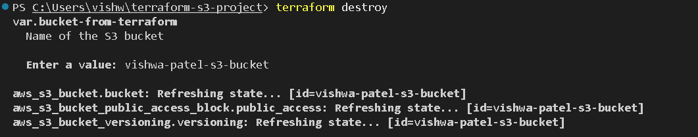
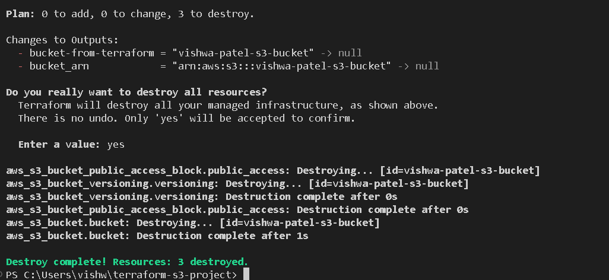

# 🚀 Terraform AWS S3 Bucket Project

[](https://www.terraform.io/)
[](https://aws.amazon.com/)
[](LICENSE)

This project demonstrates how to create and manage an AWS S3 bucket using Terraform, including enabling versioning, validating state files, and securely structuring your Terraform configuration.

It is designed as a **portfolio-ready cloud engineering project** to help you strengthen your skills and resume.

---

## 📘 Project Architecture

  


---

## 🧰 Prerequisites

### Local Requirements
- Terraform (v1.0+ recommended)
- AWS CLI
- Git
- VS Code (or any code editor)

### AWS Requirements
- An AWS account
- An IAM user with the following permissions:
  - `AmazonS3FullAccess`
  - `IAMReadOnlyAccess`
  - `AmazonEC2ReadOnlyAccess`

### Authentication

Run this before using Terraform:

```
aws configure
```

Provide your AWS Access Key and Secret Key.

### 📂 Project Structure

```
terraform-s3-project/
│── main.tf
│── variables.tf       (optional)
│── outputs.tf         (optional)
│── assets/            (contains screenshots)
```

🛠️ Terraform Configuration (main.tf)

This is the file where your S3 bucket is defined:

### Example main.tf
```
provider "aws" {
  region = "us-east-1"
}

resource "aws_s3_bucket" "my_bucket" {
  bucket = "my-terraform-bucket"
  acl    = "private"

  versioning {
    enabled = true
  }

  tags = {
    Name        = "MyBucket"
    Environment = "Dev"
  }
} 
```
(Add screenshot of your main.tf if desired in assets/ folder)

## 📦 Deploying the Infrastructure
### 1️⃣ Initialize Terraform

```
terraform init
```
### 2️⃣ Validate the configuration

```
terraform validate
```
### 3️⃣ Plan the infrastructure

```
terraform plan
```
### 4️⃣ Apply changes to AWS

```
terraform apply
```
### First Output: 


### Second Output: 


## 💣 Destroying the Infrastructure (Optional)

### If you want to remove the S3 bucket and all Terraform-managed resources, run:

```
terraform destroy
```



### Terraform will show you a list of resources it plans to delete.
### Type yes to confirm the destruction.



⚠️ Warning:
Destroying the S3 bucket will permanently delete:

All objects in the bucket
All versions (if versioning is enabled)

## 🗄️ Verifying Your S3 Bucket in AWS Console
After applying, go to:

AWS Console → S3
You should see your bucket created.


## 🔁 Bucket Versioning Enabled
### This project demonstrates enabling versioning on your S3 bucket — useful for:

-Security

-Backups

-Auditing

-Preventing accidental file deletion


## 🌐 Pushing This Project to GitHub
Make sure your .gitignore contains:

```
.terraform/
terraform.tfstate
terraform.tfstate.backup
```

Then push normally:
```
git add .
git commit -m "Initial commit"
git push -u origin main
```

---

## 🛑 Files You Should Never Push to GitHub

When working with Terraform, some files and folders **contain sensitive information or large binaries** and should never be committed. Make sure your `.gitignore` includes them.

| File / Folder                                     | Reason                                                                 |
|--------------------------------------------------|-------------------------------------------------------------------------|
| `.terraform/`                                     | Local Terraform dependencies and plugins (can be hundreds of MB)       |
| `terraform.tfstate`                               | Contains sensitive account info (Access Keys, Bucket names, etc.)      |
| `terraform.tfstate.backup`                        | Backup of state file (same sensitive info)                             |
| `.terraform.lock.hcl`                             | Terraform dependency lock file (optional, safe to ignore)              |
| `.terraform/providers/registry.terraform.io/*`    | Provider binaries (very large, do not commit)                          |

**Tip:**  
Always double-check before committing that these files are **not included**.  
Use `git status` to verify what’s staged for commit.


