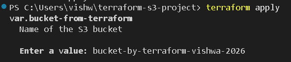
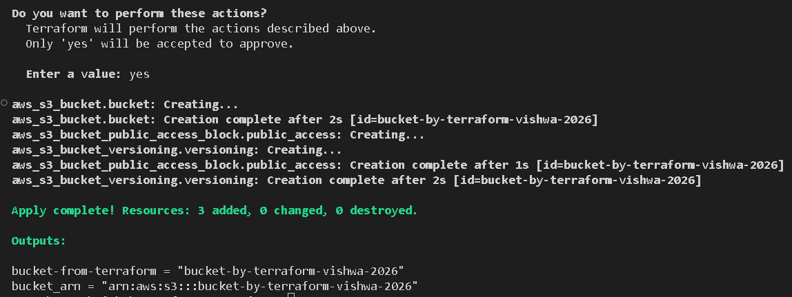

# 🚀 Deploying an AWS S3 Bucket Using Terraform

This is a mini Infrastructure-as-Code (IaC) project demonstrating how to use Terraform to deploy an AWS S3 bucket.  
It’s designed to showcase cloud engineering fundamentals, Terraform workflow, and AWS resource provisioning.

---

## 📌 **Project Overview**

Using Terraform, this project deploys:

- An Amazon S3 bucket  
- Bucket versioning (optional)  
- Tags for resource organization  
- Secure bucket configuration using AWS best practices  

This project is ideal for learning IaC, showcasing cloud skills to employers, or building foundational AWS infrastructure skills.

---

## 🛠 **Prerequisites**

Before running this project, install and configure:

### **1. Terraform**
Download & install: https://developer.hashicorp.com/terraform/downloads

Verify installation:
```bash
terraform -v
```

### **2. AWS CLI**
Install AWS CLI: https://docs.aws.amazon.com/cli/latest/userguide/getting-started-install.html

Verify:
```bash
aws --version
```

### **3. AWS Credentials**
You must configure IAM credentials locally:

```bash
aws configure
```

Provide:
- AWS Access Key ID  
- AWS Secret Access Key  
- Default region (e.g., `us-east-1`)  
- Output format (optional)

### **4. Git (optional for version control)**
https://git-scm.com/downloads

---

## 📁 **Project Structure**

```
terraform-aws-s3-bucket/
│── main.tf
│── variables.tf
│── outputs.tf
│── .gitignore
│── assets/
│     ├── terraform-apply.png
│     └── terraform-apply-results.png
│── README.md
```

---

## 🚀 **How to Deploy the S3 Bucket**

### **1. Initialize Terraform**
This downloads the AWS provider and prepares the project.

```bash
terraform init
```

### **2. Validate configuration**
Checks for errors in your `.tf` files:

```bash
terraform validate
```

### **3. Preview changes**
See what Terraform will create:

```bash
terraform plan
```

### **4. Apply the changes**
Deploys the S3 bucket to AWS:

```bash
terraform apply
```

Type **yes** to confirm.

### **5. Verify the bucket in AWS**
Go to:
**AWS Console → S3 → Buckets**

Your new Terraform-managed bucket will appear.

---

## 🧹 **Destroy Infrastructure (optional)**

To delete everything Terraform created:

```bash
terraform destroy
```

---

| Terraform apply preview |  |
| Terraform apply results |  |

---

## 🎯 **What This Project Demonstrates**

✔ Infrastructure as Code (IaC)  
✔ Terraform workflow (init → plan → apply → destroy)  
✔ AWS S3 provisioning  
✔ Using `.gitignore` correctly  
✔ Clean GitHub repo without state files  
✔ Cloud engineering fundamentals  

---

## 🧑‍💻 **Author**

**Vishwa Patel**    
Passionate about AWS, Infrastructure as Code, and cloud automation.

---

